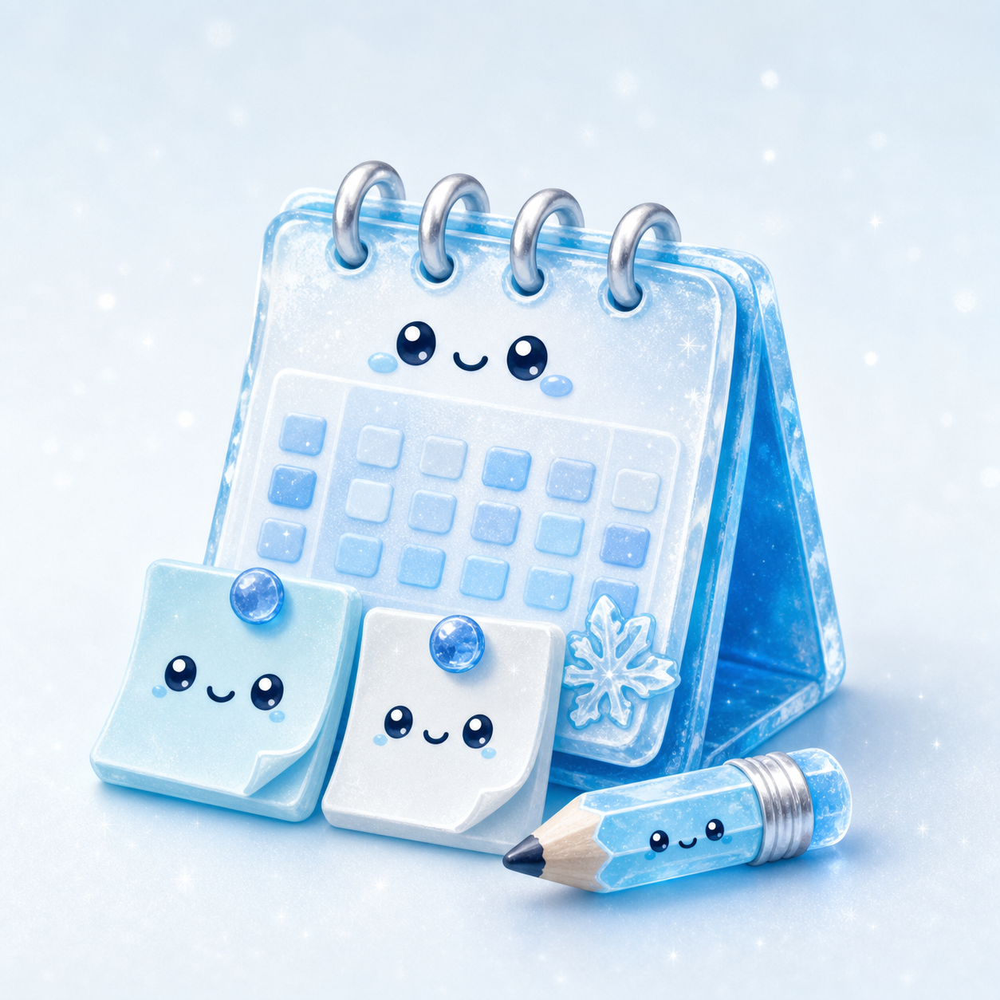
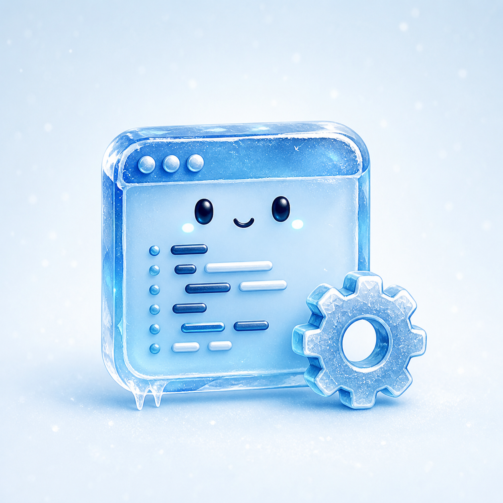

<!-- TODO: Add banner maybe -->

*I’m a full-stack developer. Although when I'm not shipping applications, I spend my time researching neural networks and studying quantum engineering.* 

---

Name: **xCirno** 
Residing in: **Sydney, Australia** 
Studying: **Computer Science at UNSW** 
Into: **Systems Programming, Neural Networks, Web Applications & more!** 
Currently: **working on side projects between lectures** 
Language: **Indonesia, English**
 
  
"<i>The hardest thing to do is to create a simple solution</i>"
 
— Someone
 

---

- First-year CS student who spends more time on personal repos than on assignments.
- I like knowing how things work all the way down, so I write my own renderer instead of importing one, talk to hardware over raw Bluetooth instead of using an app, and host my own cloud instead of renting one.
- I work across the whole stack: Rust and C at the low level, TypeScript and React on the web, Arduino and Android in between.
- Previously worked on automated deployment systems and AI integration prototypes.

 

---

**Languages**

**Web and runtime**

**Systems and tools**

 

---

- **[Vertra](https://github.com/xcirno-labs/vertra)**: a rendering engine written in Rust and compiled to WebAssembly, so it runs fast on both desktop and web.
- **[Trade Arena](https://tradearena.dev)**: benchmarks trading bots on live and historical markets, with a ranked leaderboard and trade by trade replays.
- **[Cirno Cloud](https://cloud.xcirno.dev)**: cloud services that run my other projects. Free and open for public use.
- **[xCirno Labs](https://xcirno.dev)**: my landing page and personal blogging system.
- **[WRC](https://github.com/xCirno1/WRC)**: an Android app that controls an Arduino robot over SPP/RFCOMM and BLE/GATT, tested on the HC-06.
- **[Search Toolkit](https://github.com/xCirno1/search-toolkit)**: a Chrome extension for tracking web history and changing Google Search results.
- more coming soon...
 

---

 

---

Feel free to reach out about anything I build.

 

  

